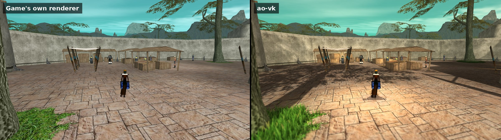
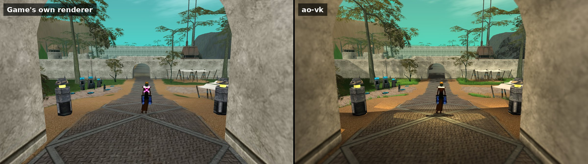
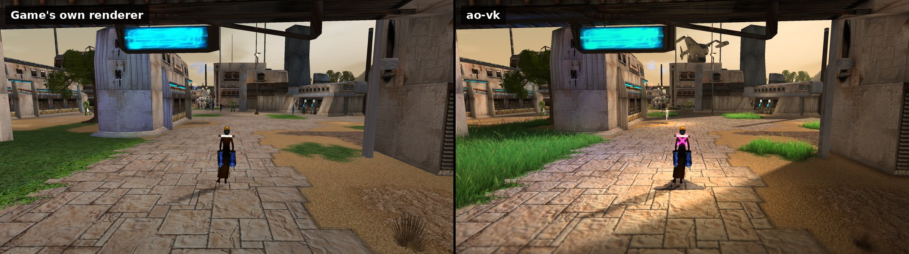
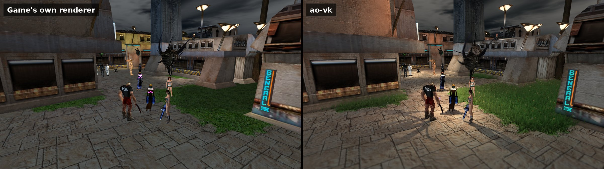
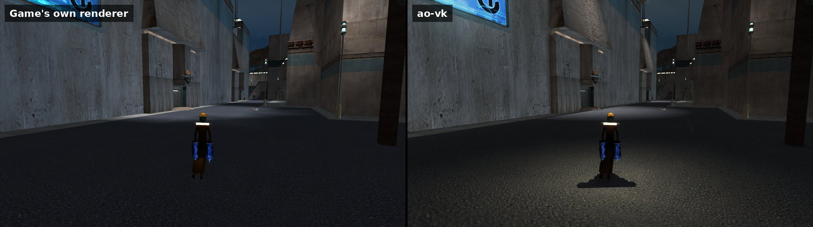
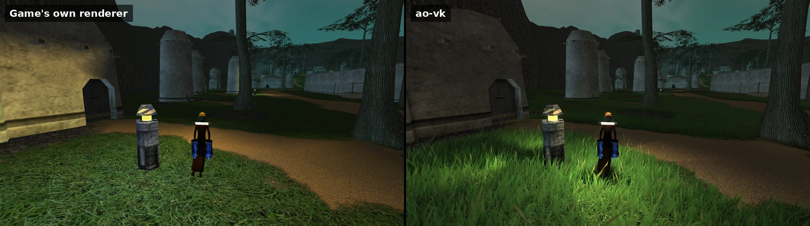
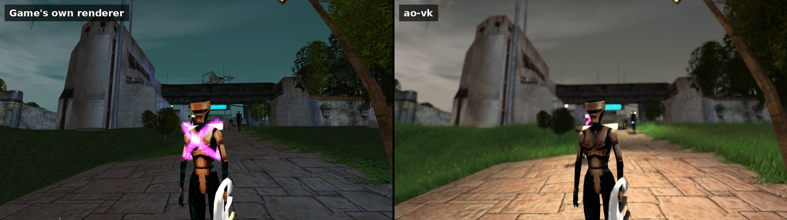
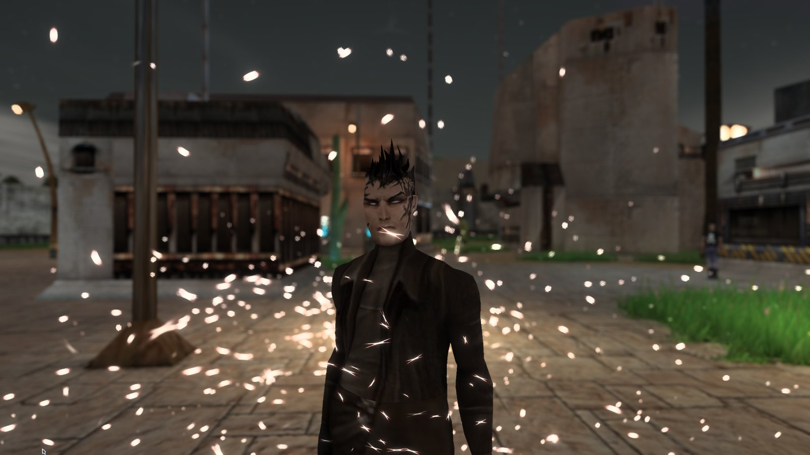

# ao-vk

A modern Vulkan renderer for Anarchy Online (the Project Rubi-Ka client), dropped in as a replacement for the
game's renderer DLL, `randy31.dll`. The game keeps running its own code; ao-vk takes over the Direct3D 7 drawing
underneath it and draws everything with Vulkan, adding modern lighting, shadows and effects while doing so - and is
step by step replacing the game's renderer code itself with native code (see *Replacing the game's renderer*).
Despite the added effects it is often faster than the game's own renderer, most of all in crowds (see
*Performance*).

(Its files still carry the project's earlier name, randy-vk: `randy-vk.ini`, `randy-vk.log`, the `RANDYVK_*`
environment variables.)

It is client-side only: no game files, network traffic or gameplay are changed, and no Funcom files are part of this
repository. Every enhancement can be switched off (in-game or with one hotkey) to get the game's own look back.

## Contents

- [Videos](#videos)
  - [Walking through Newland](#walking-through-newland)
  - [Grass](#grass)
  - [Newland](#newland)
  - [Spell particles](#spell-particles)
- [Screenshots](#screenshots)
  - [West Bank](#west-bank)
  - [Newland by day](#newland-by-day)
  - [Night](#night)
  - [Depth of field](#depth-of-field)
  - [GPU particles](#gpu-particles)
- [What it adds](#what-it-adds)
- [Performance](#performance)
- [Replacing the game's renderer](#replacing-the-games-renderer)
- [Requirements](#requirements)
- [Installing](#installing)
  - [Steps (Windows and Wine alike)](#steps-windows-and-wine-alike)
  - [Wine / Linux notes](#wine--linux-notes)
  - [Uninstalling](#uninstalling)
- [Settings](#settings)
  - [Hotkeys (Ctrl+Shift + key)](#hotkeys-ctrlshift--key)
  - [Environment variables](#environment-variables)
- [Known limitations](#known-limitations)
- [How it works](#how-it-works)
- [Building](#building)
  - [Testing](#testing)
  - [Layout](#layout)
- [License](#license)

## Videos

### Walking through Newland

https://github.com/user-attachments/assets/07daac86-358c-4e47-ac21-5247b7c71a87

### Grass

https://github.com/user-attachments/assets/740be825-a600-4441-b9d0-135ec040b125

https://github.com/user-attachments/assets/99c6c440-424e-47ff-aacc-0a2cd3c5fc84

### Newland

https://github.com/user-attachments/assets/2a29fc01-2e78-49c9-958b-9dea8c1cdf59

https://github.com/user-attachments/assets/ddee9f9c-0938-49c4-b66e-05b8dee89a30

### Spell particles

https://github.com/user-attachments/assets/05409949-a300-487d-a9b1-d6d8d400aaf8

https://github.com/user-attachments/assets/00f57f4c-7343-482b-ac3e-9604693b53a8

## Screenshots

The game's own renderer on the left, ao-vk on the right - the same moment, switched with Ctrl+Shift+E. Click an
image for the full size.

### West Bank

Sun shadows, HDR, colour grading and the ground grass.





### Newland by day

Grass and paths.



### Night

Every lamp lights its surroundings and casts shadows.







### Depth of field

Focused on your character.



### GPU particles

Spell effects with GPU particles, and depth of field.



## What it adds

**Lighting**
- Per-pixel lighting instead of the game's per-vertex lighting.
- Light override: every nearby light lights every surface (the game picks at most 8 lights per object, so the
  ground and big objects often missed the lights around you). Up to 64 lights a frame.
- Separate intensity sliders for lamps and for the lights characters carry (your own included).
- Generated surface relief: normal maps derived from each texture's brightness, the ground included.
- Side-loaded normal maps for individual game textures (`randy-vk\materials\`, see `docs/materials.md`).
- Sunlight shining through leaves and grass.
- Anisotropic filtering.

**Shadows**
- Sun shadows: cascaded shadow maps with soft shadows whose penumbra grows with distance (sharp where an object
  meets the ground, soft further out). Resolution 1024-8192.
- Contact shadows for small details the shadow map misses.
- Point light shadows: lamps and character lights cast real shadows (up to 16 at once, resolution 256-2048),
  fading in and out smoothly as lights come and go.
- The game's round blob shadows are replaced while sun shadows are on.

**HDR and effects**
- HDR rendering with tone mapping and exposure control.
- Bloom (depth-aware, so halos don't bleed through objects in front) and glow on spell and fire effects.
- Night glow: lit windows, signs and screens glow after dark.
- Ambient occlusion and screen-space indirect light (bounce light).
- Volumetric light: sun shafts through haze.
- Screen-space reflections on water, glossy surfaces and optionally wet-looking floors.
- Motion blur (camera and per object), temporal anti-aliasing with sharpening.
- Depth of field with bokeh, focused on your character by default.
- Colour grading: saturation, contrast, warmth, a cooler night tint, vignette, and your own `.cube` look-up tables
  (`randy-vk-day.cube`, `randy-vk-night.cube` next to `randy-vk.ini`).

**Plants**
- Real grass on the ground: fields of individual blades grow wherever the ground's texture is grass, as bright as
  the ground they grow on by day and by night. They grow in tufts with dry and taller patches, with wildflowers, seed
  heads and broad blades mixed in, and they thin out towards paths and fade out gradually at a distance you choose.
- Waves of wind run through the grass, with gusts sweeping over it as lighter bands.
- Sunlight on the blades: backlit tips when you look towards the sun, a sheen, rounded shading.
- The blades cast sun shadows onto the ground, each other and paths, softened so that fields stay as bright as
  before.
- Grass bends around characters walking through it and stays trodden for a few seconds behind them.
- Grass, bushes and trees sway in the wind.
- Grass and plants bend out of the way of characters walking through them, then spring back.
- Big plant quads are split near characters so they bend smoothly instead of tilting as one piece.
- Distant foliage is shaded more cheaply (a level of detail), for speed in grassy areas.

**Characters**
- Phong tessellation: character bodies and heads get rounder silhouettes up close. Hard edges (armour, weapons)
  stay sharp.

**Particles**
- GPU particles with curl-noise flow on sparkle-type spell effects (which effects: `[Particles]` in `randy-vk.ini`).

**Performance**
- The Vulkan work runs on its own thread, so the game's thread only hands draws over.
- Characters are skinned on the GPU and animated by native code (see *Replacing the game's renderer* below): in a
  100-character test crowd the game thread's renderer work drops from 8.4 to about 0.9 ms a frame.
- Caches (mesh fingerprints, shadow casters, shared vertex buffers) keep the per-frame cost down; in big crowds the
  game's own CPU work, not the renderer, is usually the limit.
- A built-in profiler that measures what each enhancement costs where you stand (Ctrl+Shift+O, see below).

## Performance

Anarchy Online's own renderer is held back by the CPU, not the graphics card. One thread runs the game, sends every
draw to Direct3D 7 one call at a time, and animates every character's mesh on the CPU. So crowds and busy cities
pull the frame rate down even on a fast PC, while the graphics card sits mostly idle. (The client also caps itself
at 100 FPS; AOReloaded's frame rate setting lifts that.)

ao-vk spends that idle graphics card on its effects, and takes work off the game's thread:

- The Vulkan work runs on a thread of its own: the game's thread only hands the draws over.
- Characters are animated (skinned) on the graphics card instead of the CPU.
- Static meshes stay on the graphics card and are drawn by reference instead of being sent again every frame.
- The interface can be redrawn fewer times a second than the 3D (`RVK_UiRate`, 60 recommended).

How much that gains depends on where the time goes:

- **Crowds gain the most.** Animating characters is the game's heaviest renderer work, and it moves to the graphics
  card.
- **Busy cities** gain from the cheaper draw path: on the PC below, a busy spot ran at 178 FPS with every effect
  on.
- **Quiet areas** were never limited by the CPU; there the frame rate depends mostly on which effects you run and
  how strong your graphics card is.

Measured on one PC (Intel Core i5-11600K, NVIDIA RTX 4070 Ti, 2560x1440, Linux with Wine):

| Where | Before | With ao-vk |
| --- | --- | --- |
| 100 animated characters (test harness) | 118 FPS, game thread 8.4 ms a frame (the game's own character code) | 350-410 FPS, game thread 0.9 ms (skinned on the graphics card) |
| A busy city spot, every effect on | 132 FPS (ao-vk's first draw path) | 178 FPS (draws folded and retained) |
| The interface's cost to the game thread | 1.5 ms a frame (redrawn every frame) | 0.34 ms (`RVK_UiRate` 60) |

The game's own renderer on the same PC (through D7VK) ran crowds at about 100-110 FPS, but that was not measured at
the same spots, so take it only as a rough guide.

Effects cost graphics-card time, and on a weaker card the frame rate depends mostly on them. On the PC above, with
every effect on, a frame takes about 5.6 ms of graphics-card time; the biggest shares are indirect light (0.75 ms),
sun shadows (0.48 ms at `RVK_SunRes` 2048; 1024 is much cheaper), the ground grass (0.45 ms), ambient occlusion,
motion blur, depth of field and lamp shadows (about 0.3 ms each). The profiler (Ctrl+Shift+O, under *Settings*)
measures what each costs where you stand.

## Replacing the game's renderer

ao-vk started as a layer under the game's renderer. It is now replacing that renderer too: Randy's own code (the
original `randy31_orig.dll`, about 1,900 functions) is being rewritten function by function as native code in
`proxy/native/`, with the goal of no longer loading the original at all. Each part is switched on in `randy-vk.ini`:

```ini
[Native]
Skin=on       ; character skinning - on the GPU (cpu = native on the CPU, off = the original)
Anim=on       ; character animation: keyframes, blends, the bone hierarchy
Visuals=on    ; tells the renderer exactly what each draw is (character, ground, effect...) and who carries a light
CatRender=on  ; drawing characters
CatMesh=on    ; characters' per-frame upkeep
CatQuery=on   ; attach points (weapons, effects), bones and materials by name
Device=on     ; the device layer: render state, drawing, vertex buffers, state blocks, presenting, surfaces, textures,
              ; materials
Scene=on      ; the scene layer (so far: viewports - the frame: camera, scene update, lights, the render lists)
Direct=on     ; with Device=on: render state reaches the renderer directly, one hand-off per update (default on)
Retain=on     ; (default) with Device, Scene and Direct on: static meshes kept on the GPU and drawn by handle
```

All of them but `Direct` default to `off` (the original code). They have been played with in game; if something misbehaves,
turning the one key back off brings the original back for that part.

Every part is checked against the original before it is switched on: computations side by side on random input
(`tools/native-check.sh`), drawing with a log of every Direct3D call of a frame, which must be identical with the
part off and on across a set of test scenes (`tools/calllog-ab.sh`). `tools/port-status.py` reports progress
(`docs/port-ledger.tsv`): about 170 functions are native so far and another 270 no longer reachable, roughly 17% of
the work. `docs/native.md` has the plan, results and method.

## Requirements

- Anarchy Online client (the Project Rubi-Ka client this was developed with).
- A GPU and driver with **Vulkan 1.3**, including: dynamic rendering, synchronization2, push descriptors,
  extended dynamic state 3 (colour blend enable and equation), vertex input dynamic state,
  demote-to-helper-invocation, cube map arrays and fragment-shader quad operations. Tessellation is optional
  (rounder characters need it). Any recent NVIDIA, AMD or Intel desktop GPU should qualify.
- **Tested on:** Linux with Wine 11.18 (staging, WoW64), NVIDIA RTX 4070 Ti, driver 615. Windows should work the
  same way (the DLL is a normal 32-bit Windows DLL that loads `vulkan-1.dll` from the GPU driver) but has not been
  tested yet - reports welcome. AMD and Intel GPUs have not been tested either.

## Installing

You need up to two files from a [release](../../releases) (or your own build, see below):

| File | What it is |
| --- | --- |
| `randy31.dll` | ao-vk itself |
| `version.dll` | optional: [AOReloaded](https://github.com/wannabuh/AOReloaded) with an in-game **Renderer** settings tab |

### Steps (Windows and Wine alike)

1. **Close the game** and open your Anarchy Online client folder (the one with `AnarchyOnline.exe`).
2. **Keep the game's own renderer:** rename (or copy) the existing `randy31.dll` to **`randy31_orig.dll`**.
   ao-vk loads it and lets the game's renderer code do its usual work; it must sit in the same folder.
3. **Copy ao-vk's `randy31.dll`** into the client folder.
4. Optional: **copy AOReloaded's `version.dll`** into the client folder for the in-game settings tab
   (Options, F10, **Renderer** tab). Without it, settings are changed in `randy-vk.ini` or with the hotkeys.
5. **Start the game as usual** (launcher or `AnarchyOnline.exe`). ao-vk creates `randy-vk.ini` (settings) and
   `randy-vk.log` (log) in the client folder on the first start.

To check it is active: the log's first lines say `rvk backend installed` and name your GPU, and Ctrl+Shift+E
switches between ao-vk's look and the game's own.

### Wine / Linux notes

- Use a prefix where Vulkan works (any DXVK game in it proves that). ao-vk talks to Vulkan directly; it does
  not need DXVK.
- The game still asks DirectDraw for display information outside the renderer. Wine's builtin DirectDraw should do
  for that; the tested setup used D7VK as the prefix's DirectDraw, which works. dgVoodoo is not needed.

### Uninstalling

Delete ao-vk's `randy31.dll`, rename `randy31_orig.dll` back to `randy31.dll`, and delete `randy-vk.ini` /
`randy-vk.log` if you like. Remove `version.dll` to remove AOReloaded.

## Settings

All settings live in `randy-vk.ini` (section `[Renderer]`; the native code's switches in `[Native]`, above) and are
saved whenever they change. With AOReloaded they
appear in the game's options window (F10) under **Renderer**: every feature as an on/off checkbox at the top, its
sliders and choices further down, grouped by feature. Changes apply immediately. Edits to the `[Renderer]` section of
`randy-vk.ini` made while the game runs apply too, within half a second (the options window shows them once
reopened).

Some useful ones:

| Setting | Default | |
| --- | --- | --- |
| `RVK_Enhance` | 1 | master switch: 0 = the game's own look (keeps your other settings) |
| `RVK_SunRes` | 4096 | sun shadow resolution; **1024 is much faster** and still looks good |
| `RVK_PtShadows` / `RVK_PtRes` | 8 / 1024 | how many lights cast point shadows, and their resolution |
| `RVK_CharLight` | 1 | brightness of lights characters carry (lower it if your own light feels too strong) |
| `RVK_TessOn`, `RVK_Tess*` | on | rounder characters: roundness, detail, distance |
| `RVK_FoliageLod` | 35 | distance from which foliage is shaded cheaply |
| `RVK_GrassOn` | 0 | our own ground grass: procedural blades over the terrain (off = the game's foliage only) |
| `RVK_GrassTex` | 1 | grass only where the ground's own texture is green (not on sand, brick, roads) |
| `RVK_GrassDist` / `RVK_GrassBlades` / `RVK_GrassHeight` | 25 / 5 / 0.5 | how far the grass reaches (world units), blades a patch, blade height |
| `RVK_GrassWidth` | 1 | blade width (1 = default; 0.25–3) |
| `RVK_GrassBright` | 1 | grass brightness against the ground it grows on (1 = the same; 0.5–1.5) |
| `RVK_GrassVary` | 1 | variety: tufts, dry and tall patches, colour jitter (0 = an even lawn; up to 2) |
| `RVK_GrassFlower` | 1 | wildflowers, seed heads and broad blades among the grass (0 = none; up to 3) |
| `RVK_GrassGlow` | 1 | sunlight on the blades: backlit tips, a sheen, rounded shading (0 = off; up to 2) |
| `RVK_GrassGusts` | 1 | gusts of wind sweeping visibly over the grass (0 = none; up to 2) |
| `RVK_GrassTrail` | 1 | grass trodden by characters stays down a few seconds behind them (needs `RVK_PushOn`) |
| `RVK_GrassShadow` | 1 | grass blades cast the sun's shadow near the camera, onto the ground and each other (needs `RVK_SunShadow`) |
| `RVK_GrassEven` | 1 | an even grass colour: one green (1) rather than the colours of the ground under each blade (0) |

### Hotkeys (Ctrl+Shift + key)

| Key | Action | Key | Action |
| --- | --- | --- | --- |
| E | all enhancements on / off | F10 | per-pixel lighting |
| F8 | light override | F7 | sun shadows |
| F6 | point light shadows | F5 | HDR |
| F4 | bloom | F3 | ambient occlusion |
| F2 | generated relief | F1 | anisotropic filtering |
| G | indirect light | V | volumetric light |
| R | reflections | M | motion blur |
| N | per-object motion blur | D | depth of field |
| T | anti-aliasing | P | GPU particles |
| ] / [ | relief stronger / weaker | Home / End | bloom stronger / weaker |
| Insert / Delete | effect glow stronger / weaker | PgUp / PgDn | local light headroom up / down |
| L | reload the colour look-up tables | F11 | lighting debug view |
| F9 | frame dump (draw list + screenshot next to the log) | O | profiling sweep (below) |
| H | hide the game's interface (screenshots) | | |

**Profiling sweep (Ctrl+Shift+O):** stand still for a minute or two; ao-vk switches each enhancement off in turn,
measures, and writes lines like `sweep sun shadows off (133.6 fps): gpu ms: ...` to the log. It shows what each
feature costs exactly where you are.

### Environment variables

| Variable | |
| --- | --- |
| `RANDYVK_DDRAW` | `rvk` (default): render with ao-vk. `off`: the game's stock renderer, ao-vk passing everything through. `trace`: the stock renderer, counting its Direct3D calls |
| `RANDYVK_THREADED` | `0` runs the Vulkan work on the game's thread (for comparison) |
| `RANDYVK_LOG` | log file path (default `randy-vk.log` in the client folder; moved to `randy-vk.old.log` once over 8 MB) |

## Known limitations

- Tested on one system (Linux, Wine, NVIDIA). Windows, AMD and Intel are untested.
- The game is a 32-bit program, so its memory is limited. Very high settings (8192 sun shadows = 1 GB of video
  memory, 16 point shadows at 2048 = 1.5 GB) are best avoided.
- In very large crowds the game's own CPU work (its interface, game logic) still limits the frame rate; the native
  character code (below) takes the renderer's share of it off the game's thread.
- Shadows are drawn from the untessellated characters.

## How it works

The built `randy31.dll` exports the same 771 functions as the game's original. Almost all of them forward to the
original (`randy31_orig.dll`), so the game's renderer code still manages its scene; ao-vk replaces what is under
it: the original's Direct3D 7 / DirectDraw calls are redirected to an implementation of those interfaces on top of
**rvk**, a Vulkan 1.3 renderer shaped like Direct3D 7's fixed-function pipeline (`docs/rvk.md`), which adds the
enhancements. On top of that, `proxy/native/` replaces the original's own functions with native ones (a jump
patched over the original's entry once the client build is recognised), keeping its object layouts so the game's
other DLLs, which derive from Randy's classes, keep working.

- `docs/architecture.md`: the overall design; `docs/frame.md`: how the game draws a frame
- `docs/rvk.md`: the renderer; `docs/materials.md`: normal maps; `docs/d3d7-vocabulary.md`: what the game uses
- `docs/native.md`: replacing Randy; `docs/skinning.md`, `docs/animation.md`: the character code

## Building

Cross-compiled on Linux (no Windows needed):

- clang-cl, lld-link, cmake, ninja
- the MSVC CRT and Windows SDK for x86, unpacked by [xwin](https://github.com/Jake-Shadle/xwin) into `~/.xwin`
- the [Vulkan SDK](https://vulkan.lunarg.com/) for Linux (glslc, headers, VMA); its `x86_64` folder is
  `VULKAN_SDK_DIR` (CMake cache variable, default `~/repos/vulkan-sdk/1.4.321.1/x86_64`)

```sh
cmake --preset linux-release -DVULKAN_SDK_DIR=/path/to/vulkan-sdk/x86_64
cmake --build --preset linux-release
```

The result is `build/linux-release/randy31.dll`, plus test programs.

### Testing

- `tools/rvk-demo.sh [out-dir] [args]`: renders test scenes with rvk headless under Wine with the Khronos
  validation layer and writes a PNG (`--shadow-test`, `--point-shadow-test`, `--grass-walk X`, `--tess 0.75`, ... -
  see `tests/rvk_demo.cpp`).
- `tools/randy-harness.sh`: drives the game's renderer through the proxy outside the game (`tests/randy_harness.cpp`):
  a 2D test scene, or animated characters (`--character`, `--crowd N`, `--blend`, `--shadow`, `--env`, `--sfx N`,
  `--lights N`, `--pick`, `--query`) and static meshes (`--static`), from files extracted from the game with
  `tools/extract-character.py` / `tools/extract-static.py`. It prints the game thread's time per frame.
- `tools/native-check.sh`: native replacements against the original functions on random input.
- `tools/calllog-ab.sh <Mode>`: every Direct3D call of a frame in each harness scene, with a `[Native]` part off and
  on; they must be identical.
- `tools/port-status.py`: how much of the original is replaced, unreachable, left.

### Layout

- `rvk/`: the Vulkan renderer (`rvk/shaders/`: GLSL, compiled into the DLL)
- `proxy/`: the `randy31.dll` proxy, the DirectDraw / Direct3D 7 implementation on rvk (`proxy/ddraw/`), the
  settings (`proxy/ddraw/rvk_settings.cpp`) and the exported settings interface AOReloaded uses
- `proxy/native/`: the native replacements of the original's functions
- `interface/`: tables generated from the original DLL and its importers (`tools/gen_interface.py`)
- `ghidra-scripts/`, `tools/`: the analysis scripts used along the way

## License

MIT, see `LICENSE`. Anarchy Online is a trademark of Funcom; this project is not affiliated with Funcom and
contains none of its files.
